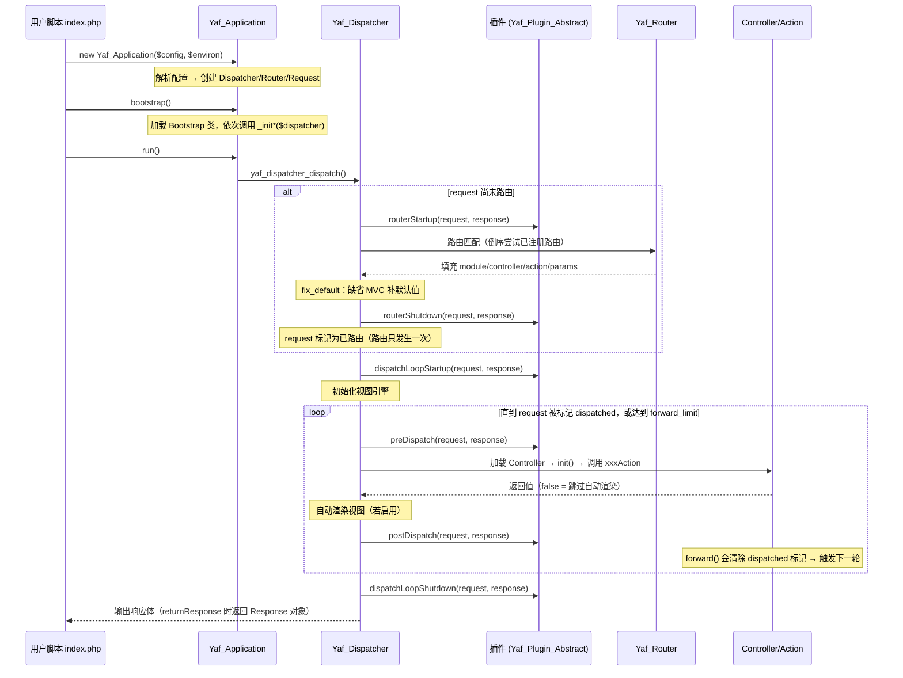

# 请求生命周期

一次 HTTP 请求进入 Yaf 后，在 C 层的完整执行路径。本篇以源码为准：主流程来自 `yaf_dispatcher.c` 的 `yaf_dispatcher_dispatch()`，启动部分来自 `yaf_application.c` 的构造/`bootstrap()`/`run()`。

## 时序总览



## 阶段详解

### 1. Application 初始化（`new Yaf_Application`）

`yaf_application.c` 的 `PHP_METHOD(yaf_application, __construct)`：

1. 全局只允许一个 Application（`YAF_G(app)` 已有对象则报 `Only one application can be initialized`）。
2. environ（section）不传时取 `yaf.environ`（默认 `product`）。
3. 实例化配置对象（ini 路径或数组），然后 `yaf_application_parse_option()`：在配置的 `application`（兼容 `yaf`）段下找 `directory`——**这是唯一的必需项**；找不到直接启动失败。同时解析 `dispatcher.defaultModule/defaultController/defaultAction`（默认 `Index`/`Index`/`index`）。
4. 设置 [Yaf_Loader](../classes/yaf_loader.md) 本地类库目录：默认 `application.directory/library`，可用 `application.library` 覆盖。
5. 创建 [Yaf_Dispatcher](../classes/yaf_dispatcher.md) 单例（内含 [Yaf_Router](../classes/yaf_router.md)，注册默认路由 `_default` = [Yaf_Route_Static](../classes/yaf_route_static.md) 或配置的 `defaultRoute`）和 [Yaf_Request_Http](../classes/yaf_request_http.md)。

### 2. Bootstrap（`$app->bootstrap()`）

加载 Bootstrap 类（默认 `application.directory/Bootstrap.php`，类名 `Bootstrap`，须继承 [Yaf_Bootstrap_Abstract](../classes/yaf_bootstrap_abstract.md)），实例化后遍历其方法表，**按声明顺序**调用所有 `_init` 前缀方法，参数是 dispatcher。这是注册插件（`registerPlugin`）、初始化全局资源的最早时机——插件必须在此注册，否则赶不上后面的钩子。

### 3. run() → dispatch()

`run()` 置 RUNNING 标志（重复 run 报 `Application is already started`），调用 `yaf_dispatcher_dispatch()`。dispatch 开头：按 SAPI 创建 Response（或清空已有 body），读取 `catch_exception` 开关和 `nesting = yaf.forward_limit`。

### 4. 路由（仅一次）

`yaf_dispatcher_dispatch()` 中 `if (!routed)` 分支：

```c
YAF_PLUGIN_HANDLE(dispatcher, YAF_HOOK_ROUTESTARTUP);   // 钩子 1
if (!yaf_dispatcher_route(dispatcher)) { 报错 ROUTE_FAILED; }
yaf_dispatcher_fix_default(dispatcher, request);        // 补默认 module/controller/action
YAF_PLUGIN_HANDLE(dispatcher, YAF_HOOK_ROUTESHUTDOWN);  // 钩子 2
yaf_request_set_routed(request, 1);
```

`yaf_router_route()` **倒序**遍历已注册路由（后注册的先匹配），第一个命中的生效；自定义路由 `route()` 返回真值才算命中。内置默认路由是 [Yaf_Route_Static](../classes/yaf_route_static.md)（`/module/controller/action/k/v...`）。路由失败抛 `Yaf_Exception_RouterFailed`。

### 5. 分发循环

```c
YAF_PLUGIN_HANDLE(dispatcher, YAF_HOOK_LOOPSTARTUP);    // 钩子 3
do {
    YAF_PLUGIN_HANDLE(dispatcher, YAF_HOOK_PREDISPATCH);   // 钩子 4（每轮）
    if (!yaf_dispatcher_handle(dispatcher)) { YAF_EXCEPTION_HANDLE; }
    YAF_PLUGIN_HANDLE(dispatcher, YAF_HOOK_POSTDISPATCH);  // 钩子 5（每轮）
} while (!yaf_request_is_dispatched(request) && --nesting > 0);
YAF_PLUGIN_HANDLE(dispatcher, YAF_HOOK_LOOPSHUTDOWN);   // 钩子 6
```

`yaf_dispatcher_handle()` 每轮做的事：

1. `set_dispatched(request, 1)`（进入即标记完成，forward 可再清除）。
2. 加载 Controller：默认模块找 `application/controllers/`，非默认模块找 `application/modules/<Module>/controllers/`；类名 `<Name>Controller`（`yaf.name_suffix` 影响）。实例化后若有 `init()` 方法则调用。
3. **若 `init()` 里调了 `forward()`**（dispatched 被清 0）：本轮直接结束，把新目标交给下一轮循环。
4. 设置视图模板目录：默认模块为 `application/views/`，否则 `application/modules/<Module>/views/`。
5. 找 action 方法：先找 `<action>Action`（原名，再小写回退）；找不到则回退到控制器的 `$actions` 映射属性（外部 Action 类，须继承 [Yaf_Action_Abstract](../classes/yaf_action_abstract.md)，执行其 `execute()`）。
6. 调用 action：路由参数按**参数名**映射到方法形参（`yaf_dispatcher_get_call_parameters`）。
7. **action 返回 `false` → 跳过自动渲染**，本轮正常结束。否则按 `yafAutoRender`（控制器属性优先于 dispatcher 的 auto_render 标志）决定是否渲染 `<控制器名小写>/<action>.phtml`：`flushInstantly` 开启则直接输出，否则渲染结果追加到 response body。

循环退出条件：request 被标记 dispatched（正常），或 `--nesting` 归零（达到 forward 上限，抛 `Yaf_Exception_DispatchFailed`：`The maximum dispatching count N is reached`）。

### 6. 响应输出

`dispatchLoopShutdown` 之后，若 request 已 dispatched：未开 `returnResponse()` 时调用 `response->response()` 直接输出 body 并清空；开了则把 Response 对象返回给 `run()` 的调用者。

## forward 机制

[Yaf_Controller_Abstract::forward()](../classes/yaf_controller_abstract.md)（`yaf_controller.c`）修改 request 的 module/controller/action/params，并 `set_dispatched(0)`。dispatch 循环的条件 `!dispatched && --nesting > 0` 因此再跑一轮 preDispatch → handle → postDispatch——**不重新路由，不重复 routerStartup/routerShutdown/dispatchLoopStartup 钩子**（request 已标记 routed）。

约束：

- 上限为 `yaf.forward_limit`（默认 5）。`yaf.c` 的 `OnUpdateForwardLimit`：**0 或负数会被钳制回默认值 5**（防止计数器下溢导致死循环）。
- 超限抛 `Yaf_Exception_DispatchFailed`。
- `init()` 中 forward 与 action 中 forward 殊途同归：都是清 dispatched 标记，由下一轮循环接管，同样受上限约束。

## 插件钩子一览

钩子方法名（小写匹配，`php_yaf.h` 中定义）与触发时机，全部由 `YAF_PLUGIN_HANDLE` 宏在 dispatch 流程中显式调用，注册顺序即执行顺序，参数均为 `($request, $response)`：

| 顺序 | 钩子方法 | 触发时机 |
| --- | --- | --- |
| 1 | `routerStartup` | 路由匹配之前（仅首次路由时） |
| 2 | `routerShutdown` | 路由成功、补默认值之后（仅首次路由时） |
| 3 | `dispatchLoopStartup` | 分发循环开始前（每次 dispatch 一次） |
| 4 | `preDispatch` | 每轮 handle 之前（forward 会重复触发） |
| 5 | `postDispatch` | 每轮 handle 之后（forward 会重复触发） |
| 6 | `dispatchLoopShutdown` | 分发循环结束后 |

规则：

- 插件继承 [Yaf_Plugin_Abstract](../classes/yaf_plugin_abstract.md)，只需覆写关心的钩子。
- 钩子内抛未捕获异常且 `catchException` 开启时，走异常处理器（见下）。
- forward 只影响循环体：`preDispatch`/`postDispatch` 按轮数重复，其余四个钩子各只触发一次。

## 异常处理

`YAF_EXCEPTION_HANDLE` 宏：任何阶段抛出未捕获异常且 `catchException=1` 时，调用 `yaf_dispatcher_exception_handler()`——把请求改写到当前模块（找不到则默认模块）的 `ErrorController::errorAction`，异常对象放入 request 参数 `exception`（模板里用 `$request->getException()` 取），然后执行该 action；`returnResponse` 未开启时直接输出响应。注意：错误页执行完 dispatch 即返回，**errorAction 里的 forward() 要到下一次 dispatch() 调用才生效**。

未开启 `catchException` 时异常原样抛给用户脚本。

## 关键源码索引

| 事实 | 位置 |
| --- | --- |
| 分发主循环与钩子顺序 | `yaf_dispatcher.c` `yaf_dispatcher_dispatch()` |
| Controller/Action 加载与渲染 | `yaf_dispatcher.c` `yaf_dispatcher_handle()` |
| Bootstrap `_init*` 调用 | `yaf_application.c` `PHP_METHOD(yaf_application, bootstrap)` |
| 配置解析与 `directory` 必需 | `yaf_application.c` `yaf_application_parse_option()` |
| forward 清 dispatched 标记 | `yaf_controller.c` `PHP_METHOD(yaf_controller, forward)` |
| forward_limit 钳制 | `yaf.c` `OnUpdateForwardLimit()` |
| 钩子方法名常量 | `php_yaf.h` `YAF_KNOWN_NAMES` |
